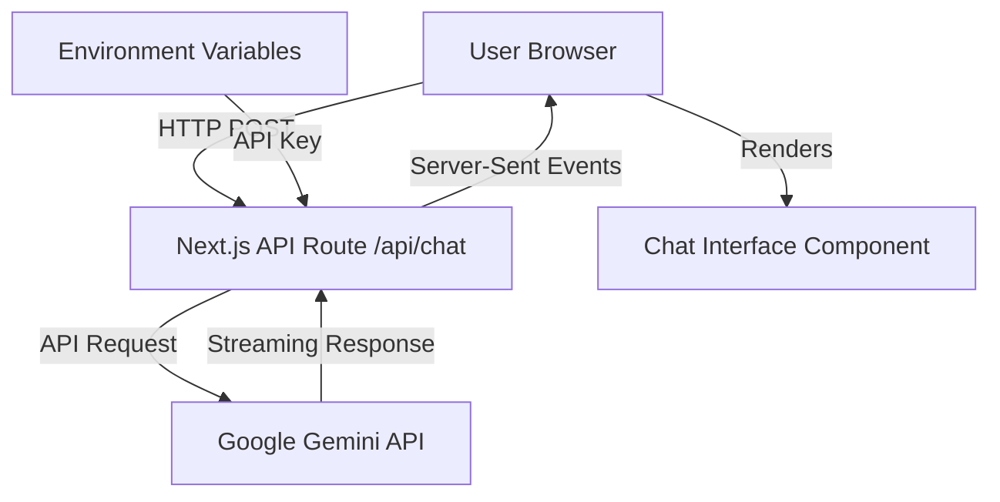
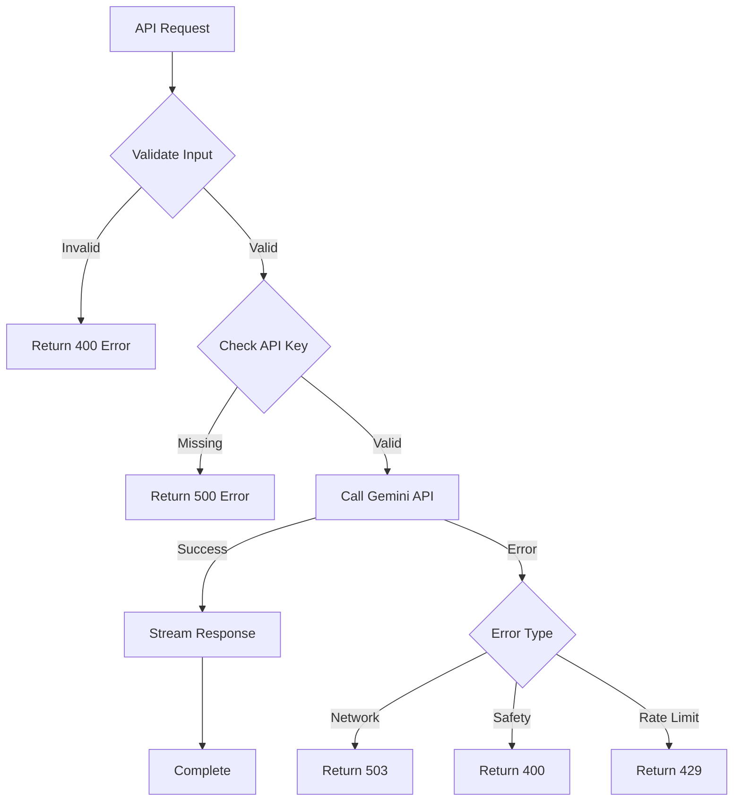

# Design Document: Gemini AI Chatbot Integration

## Overview

This design document outlines the architecture and implementation approach for integrating Google's Gemini 1.5 Flash AI model into the KickAI Judge landing page. The solution consists of a Next.js API Route Handler for backend communication with the Gemini API, and a React-based chat interface component for the frontend user experience.

The implementation follows Next.js 15 App Router conventions, uses TypeScript for type safety, and leverages the existing UI component library (Radix UI) for consistent styling.

## Architecture

### High-Level Architecture



### Component Structure

```
app/
├── api/
│   └── chat/
│       └── route.ts          # API Route Handler
├── chat/
│   └── page.tsx              # Chat page (optional standalone)
components/
├── chat/
│   ├── chat-interface.tsx    # Main chat component
│   ├── message-list.tsx      # Message display component
│   ├── message-input.tsx     # Input field component
│   └── message-bubble.tsx    # Individual message component
└── ui/                       # Existing UI components (buttons, etc.)
```

## Components and Interfaces

### 1. API Route Handler (`app/api/chat/route.ts`)

**Purpose**: Server-side endpoint that handles communication with Google's Gemini API

**Key Responsibilities**:
- Receive user messages via POST requests
- Authenticate with Gemini API using API key
- Stream responses back to the client
- Handle errors and edge cases

**Interface**:

```typescript
// Request body
interface ChatRequest {
  message: string;
  conversationHistory?: Array<{
    role: 'user' | 'model';
    parts: string;
  }>;
}

// Response (streaming)
// Uses ReadableStream for token-by-token streaming
```

**Implementation Details**:
- Uses `@google/generative-ai` SDK
- Configures Gemini 1.5 Flash model with safety settings
- Returns streaming response using Next.js streaming capabilities
- Validates input message length (1-2000 characters)

### 2. Chat Interface Component (`components/chat/chat-interface.tsx`)

**Purpose**: Main container component that orchestrates the chat experience

**Key Responsibilities**:
- Manage conversation state (messages array)
- Handle user input submission
- Coordinate with API route
- Display loading states
- Handle errors

**State Management**:

```typescript
interface Message {
  id: string;
  role: 'user' | 'assistant';
  content: string;
  timestamp: Date;
  isStreaming?: boolean;
}

interface ChatState {
  messages: Message[];
  isLoading: boolean;
  error: string | null;
}
```

### 3. Message List Component (`components/chat/message-list.tsx`)

**Purpose**: Displays the conversation history with auto-scrolling

**Key Features**:
- Renders messages in chronological order
- Auto-scrolls to latest message
- Shows typing indicator during streaming
- Handles empty state

### 4. Message Input Component (`components/chat/message-input.tsx`)

**Purpose**: Text input field with send button

**Key Features**:
- Textarea with character limit (2000)
- Submit on Enter key (Shift+Enter for new line)
- Disabled state during loading
- Character counter
- Clear button

### 5. Message Bubble Component (`components/chat/message-bubble.tsx`)

**Purpose**: Individual message display with styling

**Key Features**:
- Different styling for user vs assistant messages
- Timestamp display
- Markdown rendering for assistant messages
- Copy message button

## Data Models

### Message Model

```typescript
interface Message {
  id: string;              // Unique identifier (UUID)
  role: 'user' | 'assistant';
  content: string;         // Message text
  timestamp: Date;         // When message was created
  isStreaming?: boolean;   // True while response is being generated
  error?: string;          // Error message if applicable
}
```

### Conversation Context

```typescript
interface ConversationContext {
  messages: Message[];
  sessionId?: string;      // Optional session tracking
}
```

### API Configuration

```typescript
interface GeminiConfig {
  apiKey: string;
  model: 'gemini-1.5-flash';
  generationConfig: {
    temperature: number;    // 0.7 default
    topK: number;          // 40 default
    topP: number;          // 0.95 default
    maxOutputTokens: number; // 2048 default
  };
  safetySettings: Array<{
    category: string;
    threshold: string;
  }>;
}
```

## Error Handling

### Error Types and Responses

1. **API Key Missing/Invalid**
   - Status: 500
   - Message: "API configuration error"
   - User Action: Display error, contact support

2. **Network Error**
   - Status: 503
   - Message: "Service temporarily unavailable"
   - User Action: Retry button

3. **Content Safety Violation**
   - Status: 400
   - Message: "Message violates content policy"
   - User Action: Modify message

4. **Rate Limiting**
   - Status: 429
   - Message: "Too many requests, please wait"
   - User Action: Wait and retry

5. **Invalid Input**
   - Status: 400
   - Message: "Message must be between 1-2000 characters"
   - User Action: Adjust message length

### Error Handling Flow



## Testing Strategy

### Unit Tests

1. **API Route Tests**
   - Test valid message handling
   - Test input validation
   - Test error responses
   - Mock Gemini API responses

2. **Component Tests**
   - Test message rendering
   - Test input submission
   - Test error display
   - Test loading states

### Integration Tests

1. **End-to-End Flow**
   - User sends message → receives response
   - Streaming response updates UI correctly
   - Error handling displays appropriate messages

2. **API Integration**
   - Verify Gemini API connection
   - Test streaming functionality
   - Validate response format

### Manual Testing Checklist

- [ ] Chat interface loads correctly
- [ ] User can send messages
- [ ] Responses stream in real-time
- [ ] Error messages display appropriately
- [ ] Character limit enforced
- [ ] Auto-scroll works
- [ ] Mobile responsive design
- [ ] Keyboard shortcuts work (Enter to send)

## Implementation Considerations

### Security

1. **API Key Protection**
   - Store in `.env.local` file
   - Never expose to client-side code
   - Use `GEMINI_API_KEY` environment variable

2. **Input Sanitization**
   - Validate message length
   - Sanitize user input before sending to API
   - Prevent XSS attacks in message display

3. **Rate Limiting**
   - Consider implementing client-side rate limiting
   - Track requests per session
   - Display appropriate messages when limits reached

### Performance

1. **Streaming Optimization**
   - Use Server-Sent Events for efficient streaming
   - Implement debouncing for rapid updates
   - Optimize re-renders with React.memo

2. **State Management**
   - Keep conversation history in component state
   - Consider localStorage for persistence (optional)
   - Limit history to last 50 messages for performance

### Accessibility

1. **Keyboard Navigation**
   - Full keyboard support for input and buttons
   - Focus management for new messages
   - ARIA labels for screen readers

2. **Visual Feedback**
   - Clear loading indicators
   - High contrast message bubbles
   - Readable font sizes

### Responsive Design

- Mobile-first approach
- Touch-friendly input areas
- Adaptive layout for different screen sizes
- Proper viewport handling on mobile devices

## Dependencies

### New Dependencies to Install

```json
{
  "@google/generative-ai": "^0.21.0"
}
```

### Existing Dependencies Used

- `react` and `react-dom` - UI framework
- `next` - Framework and routing
- `typescript` - Type safety
- `lucide-react` - Icons
- Radix UI components - UI elements (buttons, scroll area, etc.)
- `tailwind-merge` and `clsx` - Styling utilities

## Environment Configuration

### Required Environment Variables

```env
# .env.local
GEMINI_API_KEY=your_api_key_here
```

### Setup Instructions

1. Obtain API key from Google AI Studio (https://aistudio.google.com/apikey)
2. Create `.env.local` file in project root
3. Add `GEMINI_API_KEY` variable
4. Restart development server

## Deployment Considerations

1. **Environment Variables**
   - Add `GEMINI_API_KEY` to Vercel environment variables
   - Ensure variable is available in production build

2. **API Route Configuration**
   - Verify route is included in build
   - Test streaming in production environment

3. **Monitoring**
   - Log API errors for debugging
   - Monitor API usage and costs
   - Track response times

## Future Enhancements

1. **Conversation Persistence**
   - Save chat history to database
   - User authentication for personalized chats

2. **Advanced Features**
   - File upload support
   - Image analysis capabilities
   - Multi-turn conversation context

3. **Analytics**
   - Track user engagement
   - Monitor common queries
   - Analyze response quality
