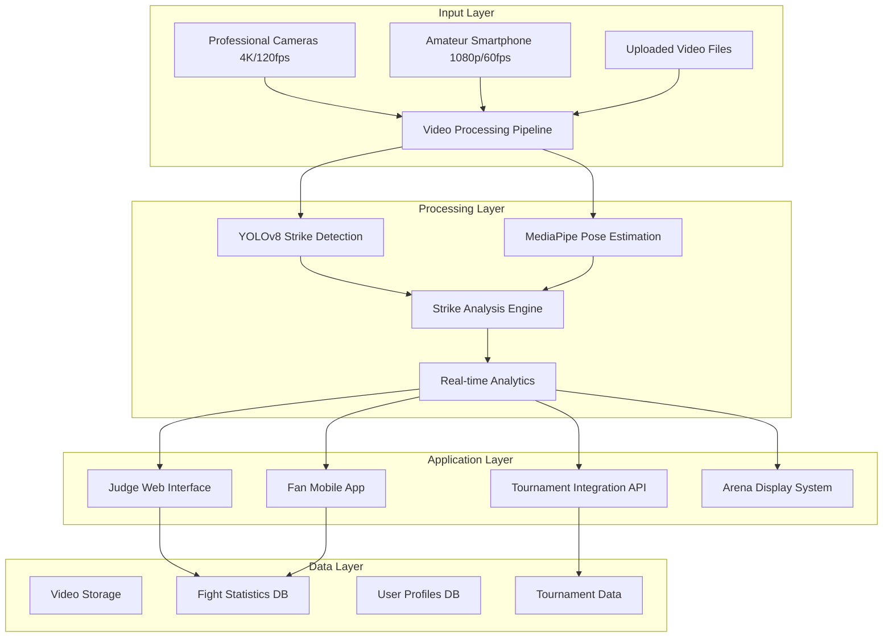

# KickAI Judge System Design Document

## Overview

The KickAI Judge System is a comprehensive AI-powered platform for analyzing kickboxing matches through computer vision. The system processes video feeds in real-time or from uploaded files to provide strike analysis, winner recommendations, and detailed fight statistics. The architecture supports both professional tournament integration and amateur mobile app usage through a scalable, multi-tier design.

## Architecture

### High-Level Architecture



### Deployment Architecture

**Professional Tournament Setup:**
- Cloud-based processing (AWS/Google Cloud)
- Multiple camera input synchronization
- Real-time analysis with 5-second delay
- High-availability infrastructure

**Amateur/Mobile Setup:**
- Local processing on user devices
- Single video file upload
- Batch processing for analysis
- Freemium mobile app distribution

## Components and Interfaces

### 1. Video Processing Pipeline

**Purpose:** Handle video input, preprocessing, and frame extraction for AI analysis

**Key Components:**
- Video format converter (MP4, AVI, MOV support)
- Frame extraction and synchronization
- Quality optimization and enhancement
- Multi-camera feed synchronization using timestamps

**Technologies:**
- OpenCV for video processing
- FFmpeg for format conversion
- Custom synchronization algorithms

**Interfaces:**
```python
class VideoProcessor:
    def process_live_feed(self, camera_feeds: List[VideoStream]) -> ProcessedFrames
    def process_uploaded_video(self, video_file: VideoFile) -> ProcessedFrames
    def synchronize_cameras(self, feeds: List[VideoStream]) -> SynchronizedFrames
    def extract_frames(self, video: Video, fps: int) -> List[Frame]
```

### 2. AI Strike Detection Module

**Purpose:** Detect and classify strikes using YOLOv8 and MediaPipe

**Key Components:**
- YOLOv8 model trained on kickboxing datasets
- MediaPipe pose estimation for fighter tracking
- Strike classification engine
- Contact point detection system

**Strike Detection Process:**
1. YOLOv8 identifies potential strike events
2. MediaPipe tracks fighter poses and movements
3. Contact detection algorithm determines clean strikes
4. Classification system categorizes strike types
5. Power estimation based on movement velocity

**Technologies:**
- YOLOv8 for object detection
- MediaPipe for pose estimation
- Custom neural networks for strike classification
- OpenCV for image processing

**Interfaces:**
```python
class StrikeDetector:
    def detect_strikes(self, frame: Frame) -> List[Strike]
    def classify_strike_type(self, strike: Strike) -> StrikeType
    def estimate_power(self, strike: Strike, opponent_reaction: Reaction) -> PowerRating
    def detect_contact(self, striker_pose: Pose, target_pose: Pose) -> ContactEvent
```

### 3. Strike Analysis Engine

**Purpose:** Analyze detected strikes and generate fight statistics

**Key Components:**
- Strike scoring system (jab=1, hook=2, kick=3 points)
- Activity tracking and mobility analysis
- Round-by-round statistics compilation
- Winner recommendation algorithm

**Analysis Metrics:**
- Strike count and accuracy per fighter
- Strike power ratings and effectiveness
- Ring control and activity percentages
- Defensive actions and blocks

**Interfaces:**
```python
class AnalysisEngine:
    def analyze_round(self, strikes: List[Strike]) -> RoundAnalysis
    def calculate_winner(self, round_analyses: List[RoundAnalysis]) -> WinnerRecommendation
    def generate_statistics(self, fight_data: FightData) -> FightStatistics
    def detect_violations(self, actions: List[Action]) -> List[Violation]
```

### 4. Real-time Analytics Service

**Purpose:** Provide live analysis and data streaming to interfaces

**Key Components:**
- WebSocket connections for real-time updates
- Data aggregation and caching
- Performance optimization for low latency
- Multi-client broadcast system

**Technologies:**
- FastAPI with WebSocket support
- Redis for caching and session management
- PostgreSQL for persistent data storage

**Interfaces:**
```python
class AnalyticsService:
    def stream_live_data(self, fight_id: str) -> WebSocketStream
    def get_current_statistics(self, fight_id: str) -> LiveStatistics
    def broadcast_update(self, update: AnalyticsUpdate) -> None
    def cache_round_data(self, round_data: RoundData) -> None
```

### 5. Judge Web Interface

**Purpose:** Provide judges with analysis tools and decision support

**Key Features:**
- Real-time strike statistics dashboard
- Video clip review with annotations
- Winner recommendation display
- Controversial moment flagging
- Ukrainian language localization

**Technologies:**
- React with TypeScript
- Tailwind CSS for styling
- WebSocket for real-time updates
- Video.js for video playback

**Interface Components:**
```typescript
interface JudgeInterface {
  LiveDashboard: React.Component<{fightId: string}>
  VideoReview: React.Component<{clips: VideoClip[]}>
  StatisticsPanel: React.Component<{stats: FightStatistics}>
  RecommendationDisplay: React.Component<{recommendation: WinnerRecommendation}>
}
```

### 6. Fan Mobile Application

**Purpose:** Provide fans and amateur fighters with fight analysis and engagement

**Key Features:**
- Video upload for amateur analysis
- Live tournament statistics viewing
- Social media integration (#AIKickboxing)
- Freemium subscription model
- Cross-platform compatibility

**Technologies:**
- React Native for cross-platform development
- Redux for state management
- Native video processing capabilities
- Social media SDK integration

**App Structure:**
```typescript
interface MobileApp {
  VideoUpload: Component<{onUpload: (video: File) => void}>
  LiveStats: Component<{tournamentId: string}>
  SocialShare: Component<{statistics: Statistics}>
  SubscriptionManager: Component<{user: User}>
}
```

## Data Models

### Core Data Structures

```typescript
interface Strike {
  id: string
  timestamp: number
  fighter_id: string
  type: 'jab' | 'hook' | 'low-kick' | 'high-kick' | 'knee'
  target_zone: 'head' | 'body' | 'legs'
  power_rating: number
  is_clean: boolean
  contact_point: {x: number, y: number}
  video_clip_url?: string
}

interface Fighter {
  id: string
  name: string
  weight_class: string
  corner: 'red' | 'blue'
  statistics: FighterStats
}

interface Round {
  number: number
  duration: number
  strikes: Strike[]
  winner_recommendation: string
  score: {red: number, blue: number}
}

interface Fight {
  id: string
  tournament_id: string
  fighters: [Fighter, Fighter]
  rounds: Round[]
  final_result: FightResult
  video_urls: string[]
  created_at: Date
}

interface FightStatistics {
  total_strikes: {red: number, blue: number}
  clean_strikes: {red: number, blue: number}
  strike_accuracy: {red: number, blue: number}
  activity_percentage: {red: number, blue: number}
  power_average: {red: number, blue: number}
  violations: Violation[]
}
```

### Database Schema

**PostgreSQL Tables:**
- `fights` - Fight metadata and results
- `fighters` - Fighter profiles and statistics
- `strikes` - Individual strike records
- `tournaments` - Tournament information
- `users` - Mobile app user accounts
- `subscriptions` - Premium subscription management

**Redis Cache:**
- Live fight data for real-time updates
- Session management for web interfaces
- Temporary video processing status

## Error Handling

### Video Processing Errors

**Camera Feed Loss:**
- Automatic failover to remaining cameras
- Quality degradation alerts to operators
- Continued analysis with reduced accuracy warnings

**Video Quality Issues:**
- Automatic quality enhancement attempts
- User notifications for suboptimal input
- Graceful degradation of analysis features

**AI Model Errors:**
- Fallback to simpler detection algorithms
- Confidence score thresholds for reliability
- Manual review flagging for uncertain detections

### System Reliability

**API Error Handling:**
```python
class ErrorHandler:
    def handle_video_error(self, error: VideoError) -> ErrorResponse
    def handle_ai_model_error(self, error: ModelError) -> ErrorResponse
    def handle_network_error(self, error: NetworkError) -> ErrorResponse
    def log_error(self, error: Exception, context: Dict) -> None
```

**Retry Mechanisms:**
- Exponential backoff for API calls
- Circuit breaker pattern for external services
- Graceful degradation for non-critical features

## Testing Strategy

### Unit Testing

**AI Model Testing:**
- Strike detection accuracy validation (90%+ target)
- False positive/negative rate measurement
- Performance benchmarking on test datasets

**API Testing:**
- Endpoint functionality verification
- Load testing for concurrent users
- WebSocket connection stability

### Integration Testing

**End-to-End Workflows:**
- Complete fight analysis pipeline testing
- Multi-camera synchronization validation
- Real-time data streaming verification

**Cross-Platform Testing:**
- Mobile app functionality across iOS/Android
- Web interface compatibility testing
- Video format support validation

### Performance Testing

**Real-time Requirements:**
- 5-second analysis delay validation
- Concurrent user load testing
- Memory and CPU usage optimization

**Scalability Testing:**
- Multiple tournament simultaneous processing
- Database performance under load
- Cloud infrastructure auto-scaling

### User Acceptance Testing

**Judge Interface Testing:**
- Usability testing with actual judges
- Decision support effectiveness measurement
- Ukrainian localization validation

**Mobile App Testing:**
- Amateur user workflow testing
- Video upload and analysis validation
- Freemium feature accessibility testing

## Security and Privacy

### Data Protection

**Video Data Security:**
- Encrypted video transmission (HTTPS/WSS)
- Temporary storage with automatic deletion
- GDPR compliance for EU users

**User Privacy:**
- Anonymized fighter data options
- Secure authentication for premium features
- Data retention policy implementation

### API Security

**Authentication and Authorization:**
- JWT tokens for API access
- Role-based access control (judges, fans, admins)
- Rate limiting for API endpoints

**Infrastructure Security:**
- Cloud security best practices
- Regular security audits and updates
- Secure deployment pipelines

## Performance Optimization

### Real-time Processing

**Optimization Strategies:**
- GPU acceleration for AI models
- Parallel processing for multiple cameras
- Efficient memory management for video streams

**Caching Strategy:**
- Redis for frequently accessed data
- CDN for video clip distribution
- Database query optimization

### Mobile Performance

**App Optimization:**
- Lazy loading for video content
- Offline capability for basic features
- Battery usage optimization

**Network Optimization:**
- Video compression for uploads
- Progressive loading for statistics
- Bandwidth-adaptive streaming

This design provides a comprehensive foundation for implementing the KickAI Judge system with scalable architecture, robust error handling, and optimized performance for both professional and amateur use cases.